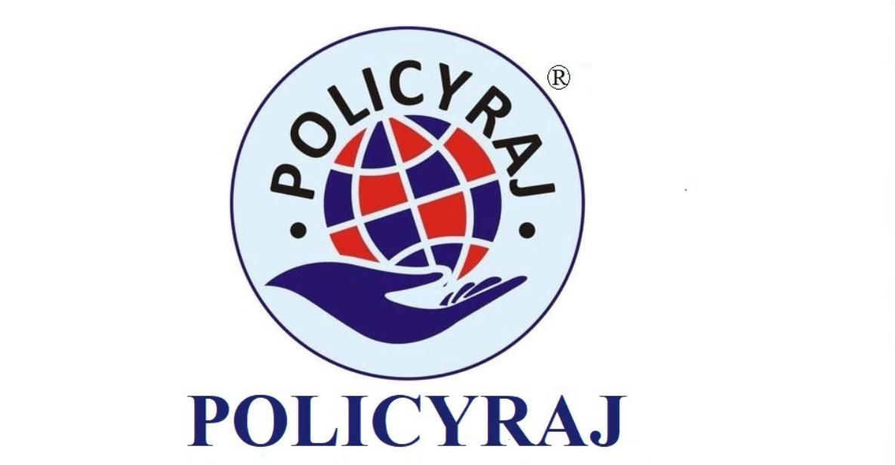

<h1 align="center">
  
  <br/>
  PolicyRaj
</h1>

<h4 align="center">A fast, mobile-first insurance advisory website for Sachin Kathuria — IRDAI-licensed advisor — with a zero-dependency AI chatbot and a serverless quote-lead pipeline.</h4>

<p align="center">
  
  
  
  
  
  
  
</p>

<p align="center">
  🌐 <a href="https://www.policyraj.com/"><b>Live site</b></a> ·
  📖 <a href="#architecture"><b>Architecture</b></a> ·
  🤖 <a href="#veera--the-ai-advisor-chatbot"><b>Chatbot</b></a> ·
  🚀 <a href="#deployment"><b>Deployment</b></a>
</p>

---

## Overview

PolicyRaj is the digital storefront for an independent, IRDAI-licensed insurance advisor. It is intentionally built with **zero frameworks and zero build tooling** — plain HTML5, CSS3, and vanilla ES6+ JavaScript — so every page loads instantly, is trivial to audit, and can be deployed anywhere that serves static files.

The one place the project *does* reach for infrastructure is lead capture: quote and newsletter submissions are handled by small, single-purpose **AWS Lambda functions** that email leads straight to the advisor — no database, no ops burden, near-zero cost.

|  |  |
|---|---|
| **Product** | Insurance advisory — health, life, motor, travel, home, business, and 7+ insurer partner pages |
| **Advisor** | Sachin Kathuria (IRDAI-licensed) |
| **Stack** | Vanilla HTML/CSS/JS · Node.js/Express (optional backend) · AWS Lambda + SES · Docker/ECS |
| **AI Chatbot** | "Veera" — 277-entry pattern-matching engine, **no external LLM API, no API key** |
| **Pages** | 29 static HTML pages |

---

## Features

### 🎯 Customer-facing
- **Instant quote calculators** for Health, Life, Motor, Travel, Home, Business, Event, Accidental, Office, and WC insurance
- **7 insurer partner pages** (HDFC Life, HDFC Ergo, ICICI Lombard, Bajaj Allianz, LIC India, Niva Bupa, Tata AIG) with product comparisons
- **AI document scanner** (`ai-scan.html`) for policy/document uploads
- **Blog, FAQ, claims-assistance, and insurer-comparison pages**
- **"Did You Know" insurance trivia box** in place of a dead newsletter widget
- Fully responsive, app-like mobile experience — 44×44px tap targets, `100dvh` hero sections, iOS zoom-bug fixes, safe-area padding for notches

### 🤖 AI & automation
- **Veera**, a fully client-side conversational assistant with a 277-entry knowledge base — see [below](#veera--the-ai-advisor-chatbot)
- **Serverless quote pipeline** — form submission → AWS Lambda → SES email to the advisor, with automatic WhatsApp fallback if the API is unreachable

### 🛠️ Engineering
- No build step — edit and refresh
- Design-token-driven CSS (`--primary`, `--radius`, `--shadow`, etc. — one source of truth in `style.css`)
- Playwright end-to-end test suite for the chatbot (target: 30/30 questions passing)
- CI validation on every PR + one-click AWS deploy via GitHub Actions

---

## Tech Stack

| Layer | Technology | Why |
|---|---|---|
| Frontend | HTML5, CSS3, vanilla JavaScript (ES6+) | No framework tax — instant load, zero build step, easy for a solo advisor's site to maintain long-term |
| Chatbot | Custom IIFE-based pattern-matching engine | No per-message API cost, no external dependency, no data leaves the browser |
| Backend (optional) | Node.js + Express, Helmet, CORS allowlist, rate-limiting | Serves the static site and a `/api/contact` + `/api/quote` fallback path |
| Lead delivery | AWS Lambda (Node 20, ESM) + Amazon SES | Serverless, pay-per-use, no database to manage |
| Containerization | Docker (`node:20-alpine`) | Reproducible backend deploys to ECS/Fargate |
| CI/CD | GitHub Actions | PR build checks + manual-trigger ECR/ECS deploy |
| Testing | Playwright | Automated chatbot conversation testing |

---

## Architecture

```
policyraj-1/
├── website/                  ← Static frontend (deployed as-is; no build step)
│   ├── index.html             Campaign landing page (front door)
│   ├── home.html              Full site: products, calculators, contact
│   ├── health.html, life.html, motor.html, business.html,
│   │   home-insurance.html    Insurance category pages
│   ├── annuity-plans.html, child-plan.html, endowment-policy.html,
│   │   money-back-policy.html, pension-plan.html, tax-saving.html
│   │                         Plan-specific product pages
│   ├── hdfc-life.html, hdfc-ergo.html, icici-lombard.html,
│   │   bajaj-allianz.html, lic-india.html, niva-bupa.html,
│   │   tata-aig.html          Insurer partner pages
│   ├── ai-scan.html           AI document scanner
│   ├── blog.html, faq.html, claims.html, compare.html,
│   │   insurance-companies.html, disclaimer.html, privacy-policy.html,
│   │   terms.html             Content & legal pages
│   ├── style.css              Single global stylesheet (design tokens)
│   ├── script.js              Page-level JS (navbar, calculators, forms)
│   ├── chatbot.js             Veera — 277-entry KB, IIFE, ~410KB
│   ├── js/quote-api.js        Lambda Function URL client + WhatsApp fallback
│   └── policyraj.png, rakesh-avatar.svg   Brand assets
├── backend/                  ← Optional Express server (static hosting + lead API fallback)
│   └── app.js
├── aws/
│   ├── lambda/quote/          Quote-lead Lambda (SES email)
│   ├── lambda/newsletter/     Newsletter-subscribe Lambda (SES email)
│   ├── cognito/                Auth provider setup scripts
│   └── ecs-task-def.json      ECS Fargate task definition
├── Docker/Dockerfile         ← Backend container image
├── .github/workflows/        ← CI (PR checks) + manual AWS ECR/ECS deploy
├── docs/screenshots/         ← Historical UI screenshots
├── scripts/                  ← One-off dev/debug utilities
├── test-chatbot.js           ← Playwright chatbot test suite (30 questions)
├── CLAUDE.md                 ← Full engineering conventions & style guide
└── AWS_DEPLOYMENT_README.md  ← Step-by-step AWS deployment runbook
```

### Request flow — quote / lead capture

```
┌──────────────┐   POST (fetch)   ┌─────────────────────────┐   SES SendEmail   ┌────────────────┐
│  Quote form   │ ───────────────▶ │  AWS Lambda Function URL │ ─────────────────▶│ sachin@policyraj │
│  (any page)   │                  │  (ap-south-1, Node 20)   │                    │  .in — inbox     │
└──────┬───────┘                  └─────────────────────────┘                    └────────────────┘
       │  fetch() fails / API unreachable
       ▼
┌──────────────────────┐
│  WhatsApp deep link    │   wa.me/919013976999?text=<lead details>
│  (guaranteed fallback) │   — no lead is ever silently lost
└──────────────────────┘
```

`website/js/quote-api.js` calls the Lambda **Function URL** directly from the browser (Auth: NONE by design — Function URLs are meant to be public HTTP endpoints, the same trust model as a REST API). The Lambda validates the payload, sends via **Amazon SES**, and returns success — no database, no server to keep warm, no key to leak because there is no key: the endpoint is a public URL and the AWS-side authorization lives entirely in IAM around the Lambda, not in frontend code.

If the Lambda is unreachable, `quote-api.js` automatically opens a pre-filled WhatsApp message to the advisor's number, so a lead is never lost to a network blip.

### Deployment paths (two independent tracks)

```
Frontend (website/)  ──▶  Static hosting (S3 + CloudFront) — deploys on push
Backend  (backend/)   ──▶  Docker → Amazon ECR → ECS/Fargate — manual-trigger workflow
```

See [`AWS_DEPLOYMENT_README.md`](./AWS_DEPLOYMENT_README.md) for the full runbook (GitHub Secrets required, ECS setup steps, local run instructions).

---

## Veera — the AI advisor chatbot

Most "AI chatbot" projects mean *"calls OpenAI/Gemini/Claude on every message."* Veera doesn't — it's a **self-contained pattern-matching engine**, entirely client-side:

- **277 knowledge-base entries**, each with `id`, `weight` (priority), `patterns` (trigger phrases), a templated `response`, and up to 4 `quickReplies`
- Wrapped in a single **IIFE** (`(function () { ... })()`) so nothing pollutes the global scope except the 3 functions the HTML actually needs to call
- Tracks lightweight conversation context (`ctx.userName`, `ctx.lastIntent`, `ctx.followUpCount`) for name capture and natural follow-ups
- **No API key, no network round-trip, no per-message cost, no data ever leaves the visitor's browser**

```javascript
// One KB entry — this is the entire "training" surface
{
  id: 'health_insurance_basics',
  weight: 2,
  patterns: ['health insurance', 'medical cover', 'health plan'],
  response: () => `${greet()}<strong>🎯 Health Insurance</strong><br><br>...`,
  quickReplies: ['Compare plans', 'Get a quote', 'Speak to Sachin']
}
```

The tradeoff is honest: Veera can't reason about novel questions the way a real LLM can — but for a focused insurance-advisory site, a curated 277-pattern KB answers the questions that actually get asked, with zero latency, zero API bill, and zero risk of an off-brand or hallucinated answer going out under the advisor's name.

**Testing:** `test-chatbot.js` runs a Playwright suite against a local server and checks a target of 30/30 real questions.

```bash
cd website && npx http-server -p 5500   # serve the site
node test-chatbot.js                     # from the project root, in a second terminal
```

---

## Security

- **No secrets are committed.** `.env` and `website/.env` are git-ignored; SES/SMTP credentials are read from environment variables (`SMTP_HOST`, `SMTP_USER`, `SMTP_PASS`, …) at runtime, never hardcoded.
- **The Lambda Function URL is intentionally public** — it's the equivalent of a REST endpoint, not a leaked credential. Nothing sensitive is exposed by it being visible in `quote-api.js`.
- **CORS allowlist** on the Express backend restricts `/api/*` to `policyraj.in`/`www.policyraj.in` (+ localhost in dev).
- **Rate limiting** — 20 requests per IP per 15 minutes on all `/api/*` routes.
- **Helmet** security headers on every backend response.
- User-supplied text is rendered via `textContent`, never `innerHTML`, to avoid XSS.

---

## Getting Started

### Frontend only (most common — no backend needed)

```bash
cd website
npx http-server -p 5500 --cors
# open http://localhost:5500
```

### With the Express backend (contact/quote API fallback)

```bash
cd backend
npm install
npm start
# open http://localhost:3000
```

### Chatbot test suite

```bash
cd website && npx http-server -p 5500 --cors &
node test-chatbot.js
```

---

## Deployment

| Workflow | Trigger | What it does |
|---|---|---|
| `.github/workflows/ci-cd.yml` | Pull request | Installs backend deps, builds the Docker image — validates the PR before merge |
| `.github/workflows/aws-deploy.yml` | Manual (`workflow_dispatch`) | Builds & pushes the backend image to ECR, updates the ECS task definition, forces a new Fargate deployment |
| `.github/workflows/aws-deploy-full.yml` | Manual | Extended AWS deploy pipeline |
| Frontend (`website/`) | Push to `main` | Deployed via the AWS-side static pipeline (S3 + CloudFront) |

Full step-by-step setup (GitHub Secrets, ECR/ECS provisioning): **[AWS_DEPLOYMENT_README.md](./AWS_DEPLOYMENT_README.md)**.

---

## Project conventions

All coding standards — CSS design tokens, mobile breakpoints, chatbot KB format, JS patterns, accessibility rules — are documented in **[CLAUDE.md](./CLAUDE.md)**. Read it before making changes; it's the single source of truth for how this codebase is meant to be extended.

---

## Contact

| | |
|---|---|
| **Advisor** | Sachin Kathuria — IRDAI-licensed insurance advisor |
| **Phone** | 9013976999 / 8383813408 |
| **Email** | sachin@policyraj.in |
| **WhatsApp** | [wa.me/919013976999](https://wa.me/919013976999) |
| **Website** | [www.policyraj.com](https://www.policyraj.com/) |

<p align="center">Built and maintained as a solo advisor's digital storefront — fast, honest, and framework-free.</p>
